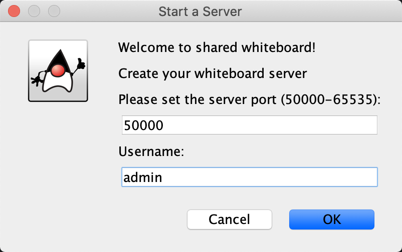
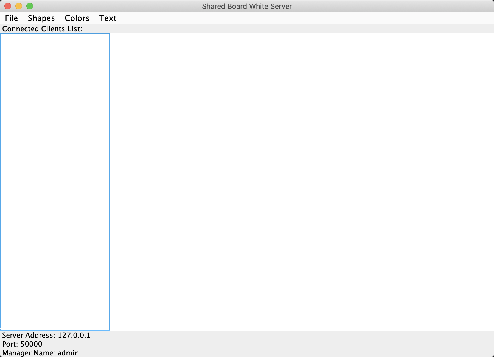
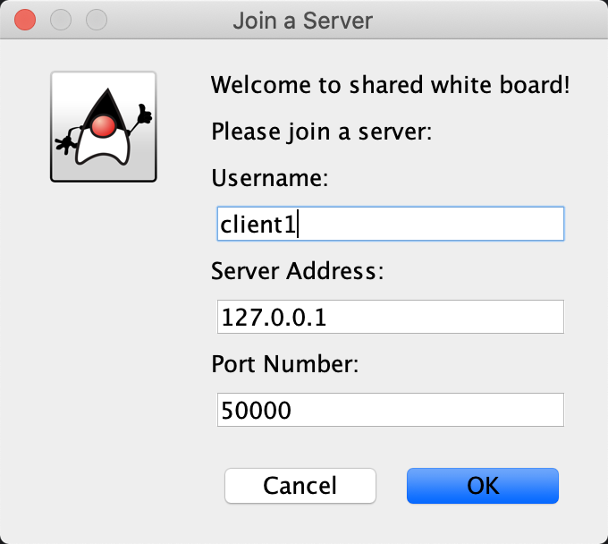
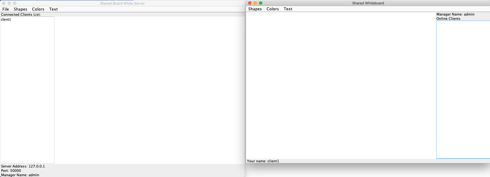
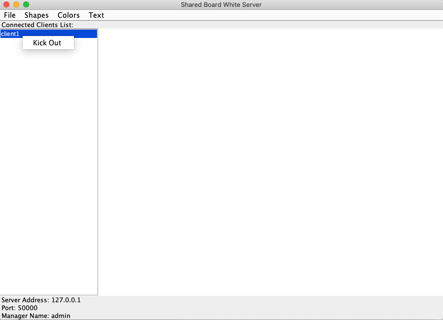
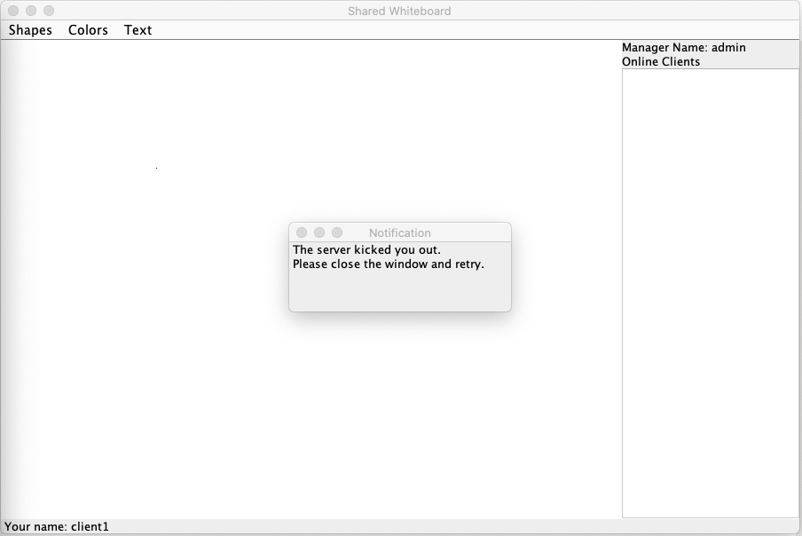
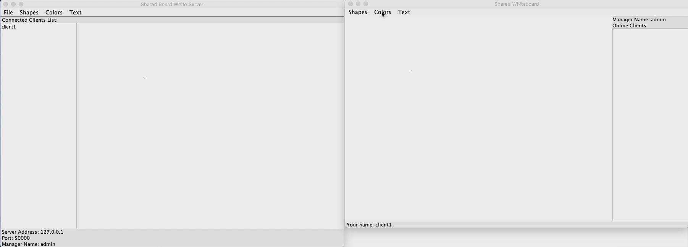

# Shared White Board
This application provide a shared white board that allow multiple users to draw simultaneously.
- Admin user can create, save and open the white board.
- General users can only draw on the white board, they can concurrently draw 4 shapes and add texts with 16 different colours.
- Admin user has the same drawing functions as general users. Admin user can control whether to accept the new user connect in and kick out a user at any time.
- The sidebar can show all connected users.

基于您的需求，我们可以进一步细化使用Java Spring和Flutter的具体实现方案。这里提供一个详细的开发蓝图，包括后端和前端所使用的关键库和技术。

# System Design

### 后端：Java Spring

1. **Spring Boot框架**：
   - 快速启动和构建REST API。
   - 内嵌的Tomcat作为HTTP服务器。

2. **用户和房间管理**：
   - **Spring Data JPA**：处理数据库操作，如用户和房间数据的存储。
   - **Hibernate Validator**：用于验证用户名是否重复。

3. **安全与会话管理**：
   - **Spring Web**：简化Web层的开发，处理HTTP请求和响应。
   - 使用基于内存的存储（例如，`ConcurrentHashMap`）来管理用户会话和房间状态，无需复杂的登录逻辑。

4. **实时通信**：
   - **Spring WebSocket**：实现多用户实时数据同步，如画板活动。
   - 使用**STOMP**协议来简化WebSocket上的消息传递。

5. **文件管理**：
   - **Spring Boot with Jackson**：用于处理JSON数据的序列化和反序列化，便于保存和读取画板数据。

### 前端：Flutter

1. **界面与交互**：
   - **Flutter SDK**：开发跨平台的用户界面。
   - **provider**：状态管理库，管理房间和用户状态。

2. **画图功能**：
   - **CustomPainter** 和 **Canvas**：用于在Flutter中绘制基础图形。
   - 可用的图形库如**flutter_shapes**可以简化形状的绘制。

3. **颜色和文本支持**：
   - 使用Flutter的**Text**和**RichText**控件来添加和管理文本。
   - 使用**ColorPicker**库，允许用户选择不同的颜色。

4. **网络通信**：
   - **http**：处理HTTP请求，如从服务器获取和发送数据。
   - **web_socket_channel**：与Spring后端的WebSocket连接。

5. **本地文件存储和访问**：
   - **path_provider** 和 **file_picker**：用于访问和存储本地文件，支持导入和保存画板数据。

### 开发和部署

- 使用**Docker**来容器化Spring Boot应用，确保环境一致性。
- 可以使用**Git**进行版本控制，确保开发过程的协作和追踪。

这个方案涵盖了基本的技术选型和库的使用，可确保项目开发的系统性和高效性。如果需要进一步的技术细节或具体代码示例，请随时告知。

## 目前的功能

用户可以开启一个房间，让其他用户加入房间，开启房间的用户是房主。
用户名字不能重复
房主可以踢出用户
共享画板上可以画基础图形，比如线条，长方形，圆形，三角形。
可以选择不同的线条颜色。
可以添加文本，文本也是支持线条颜色的。
画板数据不会保存在服务器上，它只会在房间开启的时候暂时性存储在服务器上，用户必须手动点击save来把画板数据保存为json文件。
用户在开启新房间的时候可以选择从本地导入画板，这个时候就可以导入之前保存的画板数据。
应用不需要复杂的登陆逻辑，只需要输入一个不重复的用户名即可

# How to run the programs
## Run Server
1. Make sure you are using Java 17
2. Navigate to `server` directory
3. `./mvnw spring-boot:run`
4. `export SECURITY_USER_NAME=admin && export SECURITY_USER_PASSWORD=admin`
5. You can use `./mvnw clean install` to check compilation errors

## Run in Docker
- `docker run -e SECURITY_USER_NAME=admin -e SECURITY_USER_PASSWORD=admin -p 8080:8080 your-app-image`

## Build Project in IntelliJ IDEA
1. File -> Project Structure -> Project Settings -> Artifacts -> Add Jar -> Select module and main class with specified output directory
2. Build Artifacts
3. Run your .jar files

## Run .jar

Start a server:

`java -jar Server.jar`

Start a client:

`java -jar Client.jar`

# Demo

### Start a server

Admin enter the room

### Start a client

Server received request

Client enter the room

### Kickout

Right click the client

### Drawing

# Build Flutter Project into APK
- Download Flutter SDK
- https://docs.flutter.dev/deployment/android
