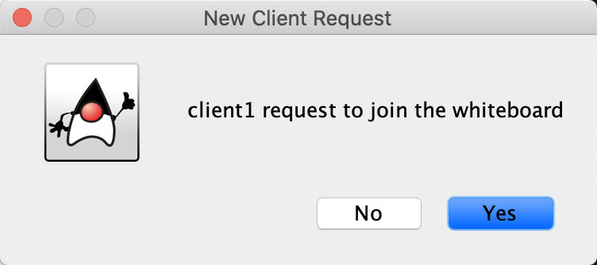

# Shared White Board
This application provide a shared white board that allow multiple users to draw simultaneously.
- Admin user can create, save and open the white board.
- General users can only draw on the white board, they can concurrently draw 4 shapes and add texts with 16 different colours.
- Admin user has the same drawing functions as general users. Admin user can control whether to accept the new user connect in and kick out a user at any time.
- The sidebar can show all connected users.

# System Design
- Built by Java RMI. All communications are through Java RMI
- The white board data are stored in JSON.
- GUI are constructed by java.awt

# How to run the programs
## Run Project in IntelliJ IDEA
1. Open this project in IDEA
2. Mark `Client/src` and `Server/src` as Sources root
3. Edit Configuration -> Add new configuration -> Application -> Select Java 17, correct Module directory and Main class.
4. Run configurations

## Build Project in IntelliJ IDEA
1. File -> Project Structure -> Project Settings -> Artifacts -> Add Jar -> Select module and main class with specified output directory
2. Build Artifacts
3. Run your .jar files

## Run .jar

Start a server:

`java -jar Server.jar`

Start a client:

`java -jar Client.jar`

# Demo

### Start a server

Admin enter the room

### Start a client

Server received request

Client enter the room

### Drawing

